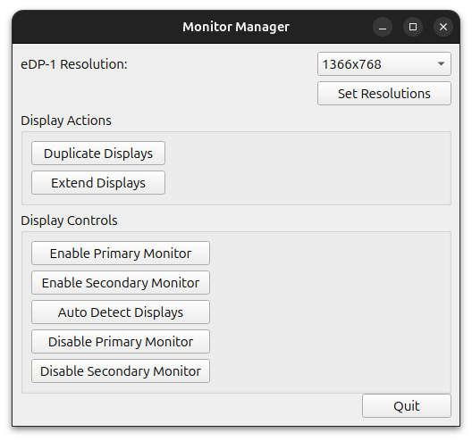

Certainly! Here's a formatted GitHub README for your Monitor Control application:

---

# Monitor Control

Monitor Control is a Python application designed for managing multiple monitors primarily for window managers. It provides a graphical interface to handle tasks such as setting resolutions, enabling/disabling monitors, and configuring display modes like duplicating or extending screens.



## Features

- **Resolution Management**: Set custom resolutions for each connected monitor.
- **Display Configuration**: Duplicate or extend displays as per your requirements.
- **Automatic Detection**: Auto-detect connected monitors and configure them accordingly.
- **Monitor Control**: Enable, disable, or auto-detect primary and secondary monitors.
- **Cross-Platform**: Works on Linux with X.Org display server (does not support Wayland).

## Installation

### Prerequisites

- Python 3.x
- PyQt5
- xrandr (for display management)

### Clone the repository

```bash
git clone https://github.com/your-username/monitor-control.git
cd monitor-control
```

### Install dependencies

```bash
pip install -r requirements.txt
```

## Usage

1. **Run the application:**

   ```bash
   python monitor_manager.py
   ```

2. **Set Resolutions:** Choose from available resolutions for each connected monitor.
3. **Display Actions:** Duplicate or extend displays to configure your workspace.
4. **Display Controls:** Enable, disable, or auto-detect primary and secondary monitors.

## Limitations

- Works only with X.Org display server.
- Does not support Wayland display protocol.

## Contributing

Contributions are welcome! If you have suggestions, feature requests, or bug reports, please open an issue or submit a pull request.

## License

This project is licensed under the MIT License. See the [LICENSE](LICENSE) file for details.

---

### Notes:

- Replace `your-username` in URLs with your actual GitHub username or organization name.
- Provide accurate instructions for installation and usage based on your application's structure and dependencies.
- Include relevant information about limitations and compatibility to manage user expectations.
- Adjust the content to fit your specific project details, such as additional features, setup instructions, or known issues.

This README template aims to give a clear overview of your project, its features, and how to get started with it. Customize it further to suit the specific details and needs of your Monitor Control application.
